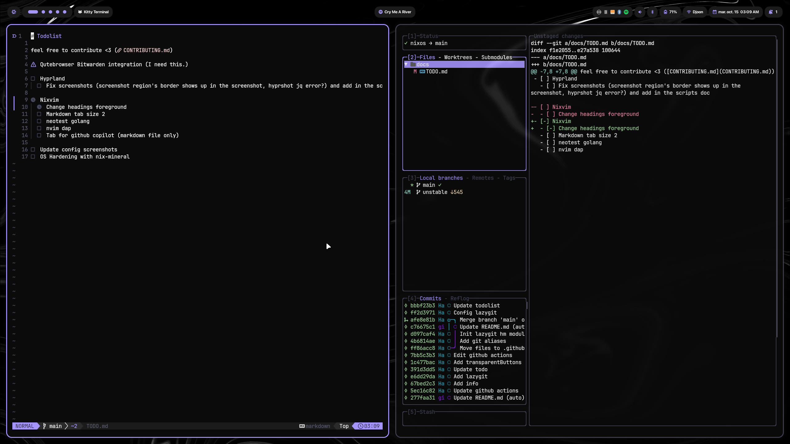

[//]: # (This file is autogenerated)
<div align="center">
    
</div>

<br>

# Nixy

<br>
<div align="center">
    <a href="https://github.com/Dylouwu/MyNixy/stargazers">
        
    </a>
    <a href="https://github.com/Dylouwu/MyNixy/">
        
    </a>
    <a href="https://nixos.org">
        
    </a>
    <a href="https://github.com/Dylouwu/MyNixy/blob/main/LICENSE">
        
    </a>
</div>
<br>

**A big shoutout to [@anotherhadi](https://www.github.com/anotherhadi) for making Nixy and many other awesome projects, I highly recommend checking his work out!**

## What is MyNixy?

**[Nixy](https://github.com/anotherhadi/nixy)** is a **Hyprland** NixOS configuration with **home-manager**, **secrets**, and **custom theming** all in one place.
It's a simple way to manage your system configuration and dotfiles.

MyNixy is a Nixy fork, which is a NixOS configuration that I use on my personal laptop and server.

**Nixy key points:**

- Hypr-ecosystem first (hyprland, hyprlock, hyprpanel, hypridle, ...)
- Home-manager support
- Secret handling with [sops](https://https://github.com/Mic92/sops-nix)
- Nvidia GPU support (optimus-manager, nvidia-prime, ...)
- Stylix/base16 custom theming

**MyNixy major additions:**

- **A fully customizable and optimized Minecraft Paper server**, which can be started and stopped directly from the glance dashboard through API calls.
- New server modules : Cyberchef, Fail2ban, Autosleep, ...
- Gaming integration with Steam x Proton, Osu-Lazer, Modrinth (Minecraft Open-Source launcher).

Other small modifications include:

- Minecraft themed grub instead of relying on systemd-boot
- Zellij over tmux
- Copilot shortcuts
- C++ environment with clangd
- Removed bluetooth module
- And many more to come ! Feel free to check the repository issues for more information about the next features to come.

## Table of Content

- [What is MyNixy?](#what-is-mynixy)
- [Table of Content](#table-of-content)
- [Gallery](#gallery)
- [Architecture](#architecture)
  - [🏠 home](#-home)
  - [🐧 nixos](#-nixos)
  - [💻 hosts](#-hosts)
  - [💾 server-modules](#-server-modules)
- [Installation](#installation)
- [Non-declarative things 😿](#non-declarative-things-)
- [Documentation](#documentation)

## Gallery



## Architecture

### 🏠 home

Those are the dotfiles and configuration files for user-level configuration

**Subfolders:**

- `programs` is a collection of apps configured with home-manager
- `scripts` is a folder full of bash scripts (see [SCRIPTS.md](docs/SCRIPTS.md))
- `system` is some "desktop environment" configuration

### 🐧 nixos

Those are the system-level configurations. (audio, gpu, bootloader, session manager, ...)

### 💻 hosts

Those are the host-specific configurations.
Each host contains a `configuration.nix` for system-level configuration, a `home.nix` for user-level configuration, and a `variables.nix` for config wide variables.

### 💾 server-modules

Those are the server modules that are used to add features to the server. These include a nextcloud environment, a glance dashboard, ssh connection support, and more. 

## Installation

1. Clone the repo

```sh
git clone https://github.com/Dylouwu/MyNixy ~/.config/nixos
```

2. Copy the `hosts/laptop` folder, rename it to your system name, and change the variables inside the `variables.nix` file
3. Add your `hardware-configuration.nix` to your new host's folder
4. Add your 'nixosConfigurations' inside `flake.nix`

> [!Important]
> I added few `# CHANGEME` comments in the files to help you find what to change. Be sure to check them up.
> You can use `rg "CHANGEME"` to find them all with ripgrep.

> [!TIP]
> When you add new files, don't forget to run `git add .` to add them to the git repository

5. Build the system

```sh
sudo nixos-rebuild switch --flake ~/.config/nixos#yourhostname
```

## Non-declarative things 😿

- Zen and its settings, logins (which can both be alternatively synced with a firefox account (or a password manager for the logins)), mods and extensions must be installed manually from the browser directly.
- Tailscale, Discord, Github Copilot, and other softwares
- Steam launch options (included in `nixos/steam.nix` )
- Modrinth modpacks, JVM arguments, and other Minecraft-related things
- And maybe more ☔

## Documentation

- [SCRIPTS](docs/SCRIPTS.md): Scripts that are available
- [KEYBINDINGS-HYPRLAND](docs/KEYBINDINGS-HYPRLAND.md): Keybindings available in Hyprland
- [WALLPAPERS](https://github.com/anotherhadi/awesome-wallpapers): A collection of wallpapers for Nixy.

- [LICENSE](LICENSE): MIT License
